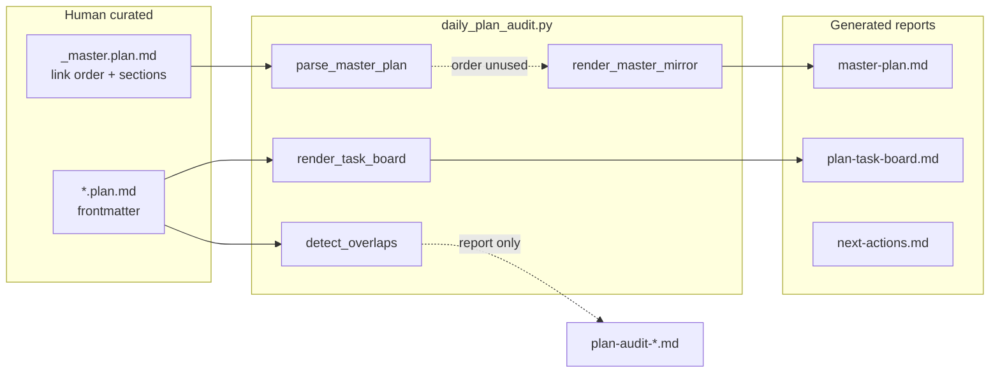
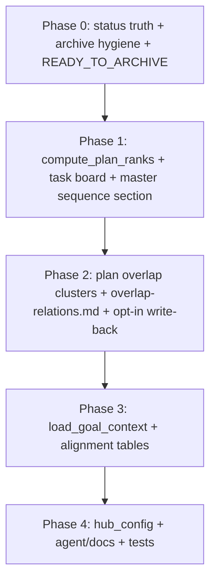

# Master plan overseer — sequencing, overlap, goal alignment

## Current state (gaps)

The planning stack is split across **human curation** ([`.cursor/plans/_master.plan.md`](.cursor/plans/_master.plan.md)) and **machine reports** ([`scripts/daily_plan_audit.py`](scripts/daily_plan_audit.py) → [`.braindrain/plan-reports/`](.braindrain/plan-reports/)).

| Artifact | What it does today | Gap vs your ask |
|----------|-------------------|-----------------|
| [`plan-task-board.md`](.braindrain/plan-reports/plan-task-board.md) | Flat table of active **items** | Sorted by **status** (Blocked → In Progress → Outstanding), then `source` path — **not** “plan 1, plan 2…” |
| [`master-plan.md`](.braindrain/plan-reports/master-plan.md) | Mirror grouped by IDE → disposition → priority | **`parse_master_plan()` child link order is ignored** for display; only used for drift |
| [`next-actions.md`](.braindrain/plan-reports/next-actions.md) | Verb queue (MERGE, IMPLEMENT, …) | Plan-level triage, not cross-plan execution rank |
| Overlap | `detect_overlaps()` — Jaccard ≥ 0.55 on item tokens | Listed only in dated audit report; **no plan frontmatter**, not on board |
| Goals | `memory_context()` checks `.braindrain/AGENT_MEMORY.md` exists | **No** link to PRD, TASK-GRAPH, or success criteria |



**Architect / coordinator** already produce ordered work at the **task-graph** layer ([`config/templates/agents/architect.md`](config/templates/agents/architect.md): `.cursor/PRD.md`, `.cursor/TASK-GRAPH.md`), but **Cursor `*.plan.md` files are not wired to that order** — that is the overseer gap.

**Status-truth gap (grill-me locked):** [`classify_status`](scripts/daily_plan_audit.py) infers Implemented/Outstanding from **body bullets**, not frontmatter `todos`. Plans with all todos `completed` still show `Implemented=0` and stay in IMPLEMENT queue when `disposition: active`.
---
## Grill-me status

**Closed for Phase 0** (2026-06-02). Phases 1–4 remain specified but out of Phase 0 implementation scope until `/masterplan` validates status-truth on this branch.

## Grill-me decisions (locked)

| Decision | Choice |
|----------|--------|
| Status source | Frontmatter `todos` primary; if todos exist, **ignore body** for count histogram |
| Body bullets | Evidence + stale-narrative detection only when todos present |
| Completed but active | Opt-in `--apply-disposition-sync` → `disposition: implemented`; default report-only |
| Post-`/masterplan` gate | **READY_TO_ARCHIVE** in `next-actions.md` + checklist in dated audit; **ask user** before archive |
| Archive drift | **Both**: move file to `.plan.archives/` when on disk; drop stale `## archived` body links when file deleted; keep `archived_plans:` metadata |
| Link rewrite on archive | **rewrite_all**: master, sibling plans, reports → `.cursor/plans/.plan.archives/<file>` |
| Partial completion | 100% todos required for implemented; partial accurate counts until then |
| Write-back authority | **Human + CLI override only** — no subagent auto-write; auditor read-only unless explicit `--apply-*` flags on the audit command |
| Report schema | **SCHEMA 1.2** — per-plan `todo_summary` + `count_source: todos\|body` in cards and `latest.md` |
| Legacy plans (no todos) | Fallback to body parsing; `count_source: body` + audit hint to add frontmatter todos |
| `/masterplan` UX | Default command unchanged; [`.cursor/commands/masterplan.md`](.cursor/commands/masterplan.md) documents `--apply-*` examples (human runs explicitly) |
| Master index on archive | **`--apply-archive`** also moves plan link from `## active` → `## archived` in `_master.plan.md` (same human+CLI gate; no separate flag unless skipped later) |

---

## Phase 0 — Status truth + archive hygiene (ship first)

Fixes false `Implemented=0`, false Outstanding, and recurring drift for superseded plans before sequencing/overlap work.

### 0a. Todo-driven plan counts

In [`scripts/daily_plan_audit.py`](scripts/daily_plan_audit.py):

- When plan frontmatter has `todos:` list, build `PlanItem` rows from todo `id` + `status` (`completed` → Implemented, `in_progress` → In Progress, `pending` → Outstanding, `cancelled` → scrapped/skipped).
- **Do not** run `collect_items()` body parsing for status histogram when todos exist.
- Map todo-only cards to next-action verbs via disposition + todo rollup (not body IMPLEMENT noise).

### 0b. Stale narrative detection

- If all todos `completed` but `disposition: active` → emit **READY_TO_ARCHIVE** (not IMPLEMENT).
- If body Problem Summary contradicts completed todos → **stale narrative** warning (existing daily-plan-auditor rule); recommend archive/replan.

### 0c. Opt-in disposition sync (human + CLI only)

**Write-back authority:** the daily-plan-auditor subagent and stop hook run **read-only** by default. Mutating plan files requires a human-run command with explicit flags (or future `/masterplan --apply` after confirmation). Subagent triggers like `[PLAN AUDIT]` must not pass `--apply-*` unless the user literally requests apply in the same turn.

CLI flags (all default **off**; mirrored in `planning_auditor` YAML):

| Flag | Effect |
|------|--------|
| `--apply-disposition-sync` | All todos `completed` + `disposition: active` → write `disposition: implemented` |
| `--apply-archive` | Move READY_TO_ARCHIVE plans to `.plan.archives/`, set `disposition: archived`, rewrite_all links |
| `--apply-overlap-relations` | Phase 2: high-confidence `relates_to` / `duplicates` only |

- When every todo is `completed` and disposition is `active`, **without** `--apply-disposition-sync`: report-only → **READY_TO_ARCHIVE** section.
- **Never** auto-archive on default `/masterplan`; `--apply-archive` only after user confirms the READY_TO_ARCHIVE checklist.

Update [`.cursor/commands/masterplan.md`](.cursor/commands/masterplan.md) (template: [`config/templates/cursor/commands/masterplan.md`](config/templates/cursor/commands/masterplan.md)) with examples:

```bash
# read-only (default)
python3 scripts/daily_plan_audit.py --repo-root . --trigger "manual-masterplan-command"

# after you confirm READY_TO_ARCHIVE list
python3 scripts/daily_plan_audit.py --repo-root . --trigger "manual-masterplan-command" \
  --apply-disposition-sync --apply-archive
```

Stop hook (`on-stop-daily-plan-audit.sh`) stays read-only — no `--apply-*`.

### 0d. Archive drift + link rewrite

- On archive: set per-plan frontmatter `disposition: archived` (and `archived: true`).
- Move file to `<ide>/plans/.plan.archives/` when it exists on disk.
- If file already deleted: remove broken links from `_master.plan.md` body; retain `archived_plans:` list entry only.
- **rewrite_all**: update markdown links in `_master`, sibling plans (`supersedes`, `parent`, `relates_to`), and generated reports to archive path.
- **`--apply-archive`**: move file, rewrite links, remove from `## active` in `_master.plan.md`, append under `## archived` + `archived_plans:` frontmatter list.

### 0e. Surfaces after `/masterplan`

Add to [`render_next_actions`](scripts/daily_plan_audit.py):

```markdown
## READY_TO_ARCHIVE (confirm with user)
- [cursor:memory_config_wiring_8d447816] all todos completed; disposition still active — confirm archive?
```

Mirror checklist in `plan-audit-YYYY-MM-DD.md` executive summary.

### 0g. SCHEMA 1.2

Bump [`SCHEMA_VERSION`](scripts/daily_plan_audit.py) to `1.2`. Per plan card / latest frontmatter:

```yaml
todo_summary: { total: 14, completed: 12, pending: 2, in_progress: 0 }
count_source: todos  # or body
```

Master mirror table column optional: `Todos (done/total)` alongside Impl/Active/Blocked.

### 0h. Legacy plans without todos

If frontmatter has no `todos` or empty list → use existing `collect_items()` + `classify_status`; set `count_source: body` and executive-summary hint: “N plans lack structured todos”.

### 0f. Tests (Phase 0)

- Plan with all todos completed → counts show `Implemented=N`, not `Implemented=0`.
- Plan with completed todos + open body checklist → body ignored for counts.
- Superseded plan missing on disk → no drift when only in `archived_plans:` metadata.
- `--apply-disposition-sync` sets `implemented` only when flag set.

**Exit criteria:** Re-run `/masterplan`; `memory_config_wiring`, `dream_weights` no longer in IMPLEMENT with false Outstanding; drift entries for deleted superseded plans gone.

---

## Target behavior

1. **`_master.plan.md` is the source of execution order** — bullet/link order under `## active` (and optional explicit rank in frontmatter) defines implement-first, implement-second.
2. **`plan-task-board.md` is plan-sequenced** — grouped or ranked by plan order, then item status within each plan.
3. **`master-plan.md` adds an overseer section** — numbered implementation queue, overlap clusters, goal alignment, drift (existing).
4. **Overlap is actionable** — detect token + file-path overlap; **opt-in** `--apply-overlap-relations` writes frontmatter (your choice); default remains report-only.
5. **Goal alignment** — tag each active plan against goalposts from PRD / TASK-GRAPH / master goals when those files exist.

---

## Phase 1 — Execution order model

### 1a. Extend `_master.plan.md` contract (template + docs)

Add to master frontmatter (parsed by existing `parse_plan_frontmatter`):

```yaml
# Optional explicit override; if omitted, use body link order under ## active
execution_order:
  - memory_config_wiring_8d447816.plan.md
  - other.plan.md
goalposts:
  - "Ship memory layers tunable via hub_config without behavior change"
  - "LivingDash sidecar isolated from MCP startup"
```

Body rules (document in README + [`config/templates/agents/daily-plan-auditor.md`](config/templates/agents/daily-plan-auditor.md)):

- **Primary order**: markdown links under `## active`, top-to-bottom (already parsed as `children` in [`parse_master_plan`](scripts/daily_plan_audit.py) L1605–1637).
- **Override**: if `execution_order:` is present, use it (paths relative to `plans/` dir).
- **Fallback** when no master: sort plans by `(_DISPOSITION_ORDER, priority P0..P3, slug)` — same as today’s mirror sort.

### 1b. `compute_plan_ranks()` in auditor

New helper in [`scripts/daily_plan_audit.py`](scripts/daily_plan_audit.py):

- Input: `master_doc`, `cards_by_source`
- Output: `dict[source, rank]` (1-based) + `rank_source` (`master_body` | `master_frontmatter` | `heuristic`)
- Exclude `is_master`, archived, `merge-ready` / `implemented` from “build queue” (still list them in mirror under disposition sections).

Wire ranks into:

- **`render_task_board_markdown`** — add columns `Seq` and `Plan` (or group with `### 1. [Plan title](source)` headers). Sort key:

```python
(plan_rank, status_rank, item_text)
```

- **`render_master_mirror`** — new section **before** IDE tables:

```markdown
## Implementation sequence (build queue)
| # | Plan | Priority | Disposition | Branch | Next verb | Source |
```

Rows follow master order; plans not in master get `—` rank bucket at end with drift warning.

- **`render_next_actions`** — optional secondary sort by `plan_rank` inside each verb bucket (MERGE stays first globally).

### 1c. Tests

Extend [`tests/test_plan_auditor_master.py`](tests/test_plan_auditor_master.py):

- Master with two linked plans A then B → task board / sequence section shows A before B.
- `execution_order:` overrides body order.
- No master → heuristic order stable and documented.

---

## Phase 2 — Overlap detection and relations

### 2a. Richer overlap signals

Keep existing item-level Jaccard in `detect_overlaps`. Add **`detect_plan_overlaps(cards, items)`**:

| Signal | Rule | Severity |
|--------|------|----------|
| Shared path refs | Same repo-relative path in active items of two plans | high |
| Token Jaccard | Existing ≥ 0.55 across plans | medium/high |
| Same branch | Two active plans map to identical `branch` | high |
| `supersedes` already set | One plan lists the other | informational |

Emit **clusters** (union-find on plan pairs) for the overseer section.

### 2b. Plan frontmatter relations (new vocabulary)

Document and parse (scalar or list):

```yaml
supersedes: older_plan_slug.plan.md   # this plan replaces that work
duplicates: other.plan.md            # do not implement both
relates_to: [plan-a.plan.md, plan-b.plan.md]
blocks: plan-x.plan.md               # this plan must finish first
```

### 2c. Opt-in write-back (`--apply-overlap-relations`)

Per your preference:

- **Default**: report-only (sections in `master-plan.md`, `plan-audit-*.md`, and a new **`overlap-relations.md`** snapshot under `.braindrain/plan-reports/`).
- **`--apply-overlap-relations`**: for high-confidence cases only:
  - path overlap + no existing `supersedes`/`duplicates` → append `relates_to` on both plans (or `duplicates` if similarity > 0.75 and titles align).
  - never overwrite existing relation keys.
  - log every mutation in audit report “Plan files updated (overlap)”.

**Never** auto-archive or change `disposition` — relations only.

### 2d. Coordinator / architect workflow

Update close-out bullets in:

- [`config/templates/ruler/RULES.md`](config/templates/ruler/RULES.md) (planning session close-out)
- [`config/templates/agents/coordinator.md`](config/templates/agents/coordinator.md)
- [`config/templates/agents/architect.md`](config/templates/agents/architect.md)

When creating a **replan** (e.g. [`memory_config_wiring`](.cursor/plans/memory_config_wiring_8d447816.plan.md) superseding `memory_lessons_hardening`):

1. Set `supersedes:` on the new plan.
2. Set old plan `disposition: archived` or list under `archived_plans:` in master.
3. Re-run auditor so sequence and overlap reports refresh.

---

## Phase 3 — Goal alignment (overseer intelligence)

### 3a. `load_goal_context(repo_root)`

Read when present (first match wins per category, concatenate excerpts):

| Source | Path | Extract |
|--------|------|---------|
| Product goals | `.cursor/PRD.md` | “goals”, “success criteria” headings (regex) |
| Execution stages | `.cursor/TASK-GRAPH.md` | `## Stage N` titles |
| Intake | `.cursor/project-context.json` | `goals`, `success_criteria` keys |
| Master | `_master.plan.md` | `goalposts:` frontmatter |

Tokenize goal lines; for each **active** plan card, compute **`goal_tags`** (top 1–3 matching goal lines by token overlap) and **`alignment_score`** (0–100).

### 3b. Surfaces

- **`master-plan.md`**: section **Goal alignment** — table Plan | Goal tags | Score | Unaligned risk.
- **`plan-audit-*.md`**: executive summary bullet when any active plan scores &lt; 40.
- Optional frontmatter on plan (report-only first): `goal_tags: [...]` via `--apply-goal-tags` (mirror overlap flag; can ship in same PR or follow-up).

### 3c. `memory_context()` upgrade

Extend to list which goal sources were loaded (not just AGENT_MEMORY), so audit YAML reflects real alignment inputs.

---

## Phase 4 — Config, agents, LivingDash, docs

### 4a. `config/hub_config.yaml`

New optional block (defaults safe/off):

```yaml
planning_auditor:
  overlap_jaccard_threshold: 0.55
  apply_overlap_relations: false
  apply_goal_tags: false
  goal_alignment_min_score: 40
```

CLI flags override YAML for one-off runs.

### 4b. Agent templates

- [`config/templates/agents/daily-plan-auditor.md`](config/templates/agents/daily-plan-auditor.md) — document new outputs, flags, JSON field `implementationSequence`, `overlapClusters`.
- Coordinator: before `[BUILD]`, read **implementation sequence #1** from `master-plan.md` / task board `Seq` column; respect `blocks:` / `supersedes:` on selected plan.

### 4c. LivingDash (light touch)

[`braindrain/livingdash_collectors.py`](braindrain/livingdash_collectors.py) `collect_plan_reports` — include excerpt of new **Implementation sequence** section if present (read from generated `master-plan.md`).

### 4d. Documentation

- [`README.md`](README.md) — planning overseer section (ordering, overlap flags, goal sources).
- [`.braindrain/OPS.md`](.braindrain/OPS.md) — run paths: `/usr/bin/python3 scripts/daily_plan_audit.py ... --apply-overlap-relations`.
- Bump audit `SCHEMA_VERSION` to `1.2` when frontmatter/report shape changes.

---

## Implementation order (for this work)



---

## Files to change (primary)

| File | Change |
|------|--------|
| [`scripts/daily_plan_audit.py`](scripts/daily_plan_audit.py) | Ranks, board/mirror render, overlap clusters, goal loader, CLI flags |
| [`tests/test_plan_auditor_master.py`](tests/test_plan_auditor_master.py) | Ordering, overlap, optional write-back |
| [`config/hub_config.yaml`](config/hub_config.yaml) | `planning_auditor` section |
| [`config/templates/agents/daily-plan-auditor.md`](config/templates/agents/daily-plan-auditor.md) | Overseer behavior |
| [`config/templates/ruler/RULES.md`](config/templates/ruler/RULES.md) | Master `execution_order` / `goalposts` / relation fields |
| [`README.md`](README.md) | User-facing planning overseer docs |

**Out of scope** (follow-ups): LLM-based replan suggestions; wiki-brain auto-contradiction for plans; editing `_master.plan.md` execution order automatically (human keeps canonical order).

---

## Verification

1. Fixture repo with `_master.plan.md` + 3 plans → assert `plan-task-board.md` `Seq` column and master **Implementation sequence** order.
2. Two plans referencing `braindrain/server.py` → overlap cluster in report; with `--apply-overlap-relations`, `relates_to` appended once.
3. Fixture `.cursor/PRD.md` with goals → alignment scores appear; plan with unrelated text scores low.
4. Full pytest: `tests/test_plan_auditor_master.py` + existing `tests/test_workspace_primer_hooks.py` audit hook test.
5. Manual: run auditor after updating [`memory_config_wiring_8d447816.plan.md`](.cursor/plans/memory_config_wiring_8d447816.plan.md) close-out; confirm archived superseded plan not in build queue.